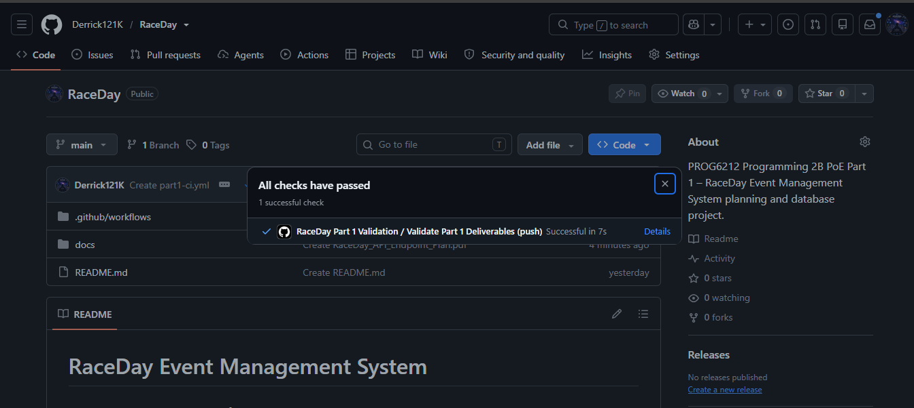

# RaceDay Event Management System

## PROG6212 Programming 2B - PoE Part 1

RaceDay is a web-based event management system for South African road
running, walking and cycling events.

This repository contains the planning and database work completed for
Part 1 of the Programming 2B Portfolio of Evidence.

## User Roles

### Organiser

Organisers can:

- Create events
- Edit events
- Delete events
- Manage event categories
- View event enrolments
- Capture participant results
- View information relating to events they manage

### Participant

Participants can:

- Create an account
- Log in
- Browse available events
- Enter an event
- Select a category
- View their own enrolments
- Track their race results and performance history

## Part 1 Deliverables

The following technical deliverables are included:

- Entity Relationship Diagram (ERD)
- API Endpoint Plan
- SQL Server Database Script
- GitHub Actions CI/CD validation
- Database Design Specification
- Project README documentation

## Repository Structure

```text
RaceDay/
│
├── README.md
│
├── docs/
│   ├── RaceDay_ERD.drawio
│   ├── RaceDay_ERD.pdf
│   ├── RaceDay_Database_Design.md
│   ├── RaceDay_Database.sql
│   ├── RaceDay_API_Endpoint_Plan.md
│   └── RaceDay_API_Endpoint_Plan.pdf
│
└── .github/
    └── workflows/
        └── part1-ci.yml


## CI/CD


GitHub Actions is used to check that the required Part 1 files are in the repository.

### GitHub Actions Result

The Part 1 validation workflow completed successfully.

